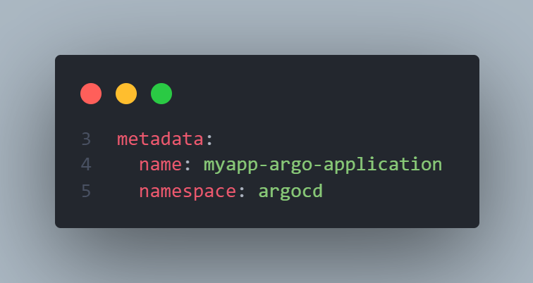

# ArgoCD Tutorial

Learning ArgoCD from [ArgoCD Tutorial for Beginners](https://youtu.be/MeU5_k9ssrs). Special thanks to Nanuchi for creating the course.

## Content

### CD Workflow with ArgoCD

1. Deploy ArgoCD in K8s cluster.
2. Configure ArgoCD to track Git repo.
   - Configured with Kubernetes YAML files, Helm Charts, or Kustomize.
3. ArgoCD monitors changes & applies them automatically.

_NOTE: ArgoCD does **not** replace CI pipelines such as Jenkins, but separates CI from CD._

**ArgoCD Advantages**

1. K8s configuration defined as code in Git repo.
2. Config files are **not** applied manually.
3. Same interface is used to update clusters.
4. Easy rollback.
   - Rollback using version control in Git repo. ArgoCD auto pulls to cluster.
5. Cluster disaster recovery.
   - Easily setup a new cluster from Git repo.

**K8s Access Control**: ArgoCD runs in the cluster, hence no external cluster access needs to be granted (eg Jenkins).

### How ArgoCD Works

**ArgoCD as K8s Extension**: This means ArgoCD uses existing K8s functions & components (eg using K8s controllers for monitoring actual & desired state, using etcd to store data).


### Configuring ArgoCD

Configure ArgoCD as K8s YAML file. Filename is `application.yaml` & CRD is `Application`.

```yaml
apiVersion: argoproj.io/v1alpha1
kind: Application
metadata:
  name: myapp-argo-application
  namespace: argocd
spec:
  project: default

  source:
    repoURL: <repo_URL>
    targetRevision: HEAD
    path: <path>

  destination:
    server: <server_URL>
    namespace: <namespace>

  syncPolicy:
    syncOptions:
      - CreateNamespace=true

    automated:
      selfHeal: true
      prune: true
```

**Source**: Defines which Git repo should be synced.

**Destination**: Defines which K8s cluster to sync to. It can be the current cluster or a remote cluster.

**Projects**: Provides logical grouping of applications (eg if they belong together). CRD is `AppProject`.

### Multi-Cluster Usage


ArgoCD just needs to be running in 1 cluster to sync Git repo <mark>across a fleet of clusters</mark>. Hence, ArgoCD only needs to be configured & managed from 1 instance.

Different clusters can be used for different purposes (eg development, staging, production). These clusters use the same base YAML configs but modify certain key values.


Kustomize is a tool that modifes Kubernetes manifest without forking. By overlaying the base folder with Kustomize, the base manifests can be modified by the specific kustomization files. In the example shown, in the production cluster, ArgoCD would pull the base folder & the `overlays/production` folder.

### Practical

**Prerequisites**

- Git Repo
  - Contains deployment & service YAML files.
  - Use [github.com/adoreblvnk/CICD_tutorials](https://github.com/adoreblvnk/CICD_tutorials.git) or use [gitlab.com/nanuchi/argocd-app-config](https://gitlab.com/nanuchi/argocd-app-config.git).
- Docker Repo
  - Contains 3 tags (for dev, staging, prod).
  - Use [nanajanashia/argocd-app](https://hub.docker.com/repository/docker/nanajanashia/argocd-app).
- K8s Cluster
  - Empty Minikube cluster.

#### Installing ArgoCD

    kubectl create namespace argocd
    kubectl apply -n argocd -f https://raw.githubusercontent.com/argoproj/argo-cd/stable/manifests/install.yaml

_NOTE: Get the description with the following command. The `-w` flag watches for changes._

    kubectl get pods -n argocd -w

**Access ArgoCD UI**

ArgoCD server (`argocd-server` as per service name) is a service that allows HTTP / HTTPS requests.

Check if the server exists with:

    kubectl get pod -n argocd

Access the server externally with the following command. This forwards from port 443 to port 8080, so ArgoCD will be accessed from port 8080.

    kubectl port-forward -n argocd svc argocd-server 8080:443

Upon reaching ArgoCD UI, the credentials to login are: `admin`. The password is sourced from the following command. Remove the "%" sign from the output if any.

    kubectl -n argocd get secret argocd-initial-admin-secret -o jsonpath="{.data.password}" | base64 -d; echo

#### Configuring ArgoCD

**Creating ArgoCD Application Config**

Full configuration is in [application.yaml](application.yaml).



**ArgoCD Namespace**: `application.yaml` has to be deployed in `argocd` namespace.

```yaml
# defines source Git repo & which path of repo to sync.
source:
  repoURL: https://github.com/adoreblvnk/CICD_tutorials.git
  targetRevision: HEAD
  path: argocd tutorial/dev
# specifies the endpoint of K8s API server & namespace.
destination:
  server: https://kubernetes.default.svc
  namespace: myapp
syncPolicy:
  syncOptions:
    # creates namespace for destination if it doesn't exist.
    - CreateNamespace=true
    automated:
      # auto-syncs Git repo, ie tracks & makes changes from Git repo into cluster.
      selfHeal: true
      # deletes component from cluster if it is deleted from Git repo config file.
      prune: true
```

_NOTE: ArgoCD polls Git repo every 3 mins. To configure "instant" deployment, configure a **Git webhook**._

The full config parameters are listed [here](https://argo-cd.readthedocs.io/en/stable/operator-manual/application.yaml).

**Apply Changes**

    kubectl apply -f application.yaml

Go to ArgoCD UI to view the newly deployed application.

#### Test Changes

Modify `dev/deployment.yaml` image as per following & push the changes.

```yaml
image: nanajanashia/argocd-app:1.2
```

Notice that ArgoCD creates new replicasets with tag `1.2`.

Modify `dev/deployment.yaml` image as per following & push the changes.

```yaml
metadata:
  name: myapp
```

Notice that ArgoCD creates a new deployment & deletes the old one.

## Credits

- prod by blvnk.
- [TechWorld with Nana](https://twitter.com/Njuchi_)
