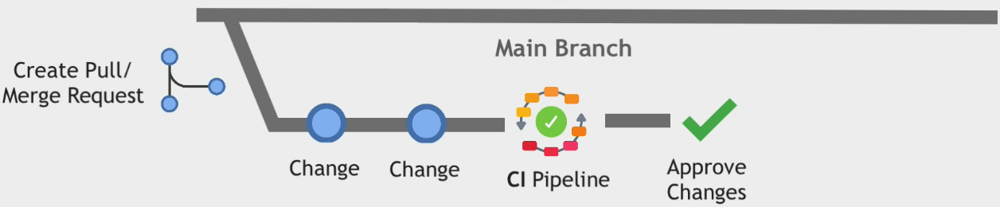

# GitOps Concepts

Learning GitOps from [GitOps](https://youtu.be/f5EpcWp0THw). Special thanks to Nanuchi for creating the course.

## Content

    GitOps = IaC + MRs + CI/CD

**GitOps**: IaC (Infrastructure as Code) done right. It takes DevOps best practices (eg version control, collaboration, compliance, CI/CD) & applied them to infrastructure automation.

**IaC**: IaC is preferred over creating infrastructure manually. IaC is <mark>easily reproduced</mark>. For example, keeping infrastructure as code files (eg `yaml`).

**MRs**: Use Merge Requests to merge branches into main codebase. Then a CI pipeline is run to validate & perform automated tests. After that, the code can be reviewed.

**CI/CD**: CI/CD implements GitOps automation. The CI pipeline is triggered during MRs. CD pipelines is triggered when the main branch changes.

**CD Pipeline**: CD automatically applies changes to the infrastructure. There are 2 types of deployment:

1. **Push Deployment**: Code is pushed from Git repo to deployment environment (eg Kubernetes).
2. **Pull Deployment**: CD Agent is installed in environment (eg K8s cluster). The Agent <mark>pulls</mark> from Git repo when a change occurs. Examples of tools are ArgoCD & FluxCD.

### GitOps Advantages

**Easy Rollback**

Rollback is achieved with version control & Git repo being synced to deployment environment.

**Increases Security**

No developer has access the developer deployment, only CD pipeline has access.

This results in a secure environment & less permissions to manage.

#### GitOps Principle

Git is the 1 & only source of truth.

## Credits

- prod by blvnk.
- [TechWorld with Nana](https://twitter.com/Njuchi_)