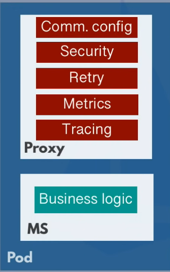
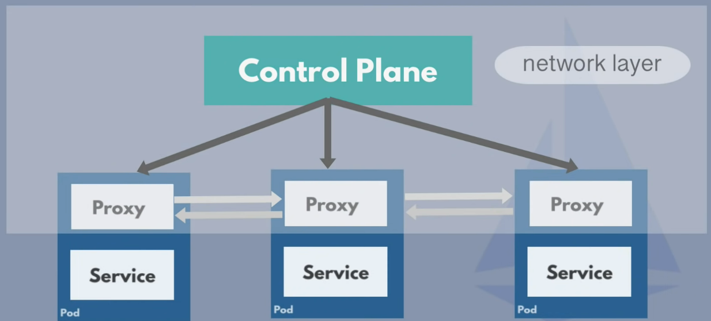
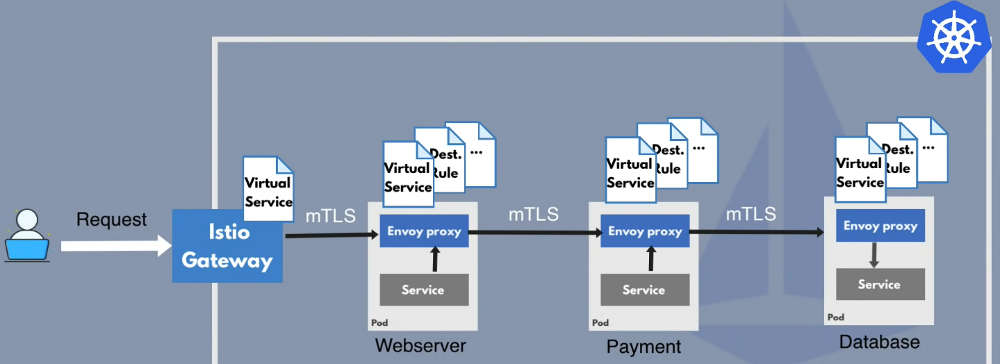

# istio tutorial

Learning Istio from TechWorldWithNana's tutorials. Taken from [Istio Summary](https://youtu.be/16fgzklcF7Y) & [Istio Setup in Kubernetes](https://youtu.be/voAyroDb6xk).

## Content

### Intro

**Service Mesh**: It manages <mark>communication</mark> between <mark>microservices</mark>.

### Challenges of Microservice Architecture

Components of Microservice:

1. **BL** (Business Logic)
   - Needed in every microservice.
2. **COMM** (Communication Configurations)
   - Endpoint of each microservice. This enables other microservices to communicate with each other.
3. **SEC** (Security Logic)
   - Ensures secure communication within cluster.
   - Access rules to authorize between microservice communication.
4. **R** (Retry Logic)
   - Retry the connection if a microservice loses connection.
5. **MT** (Metrics & Tracing)
   - Monitor performance (eg how many requests does each microservice send / receive?, how long each request take?).

Apart from the 1st point, the rest of the components have to be added to each application, further complicating development. 

### Service Mesh with Sidecar Pattern

**Sidecar Proxy**: Extract all non-business logic from application & acts as a proxy.

**Control Plane**: Instead of manually configuring Sidecar Proxy as a yaml file, Control Plane will <mark>automatically inject these Sidecar Proxies</mark> into <mark>every Pod</mark>.

The Service Mesh is the network layer.

**Traffic Split**: Configure a webserver service to <mark>redirect different amounts of traffic to different services</mark>. For example, redirecting 90% of traffic to Service v2 & 10% of traffic to Service v3; this helps to catch bugs in the newer version.

**Istio Architecture**: Envoy proxy implements the Sidecare Proxy; Istio manages the Control Plane. The Control Plane comprises of configuration, discovery, & certificates.

**Istio Configuration**

- Configured with K8s YAML files using CRD (Custom Resource Definitions) (eg `kind: DestinationRule`).
  - **CRD**: Custom K8s component for 3rd party tools.
- **2 Istio CRDs**:
   1. **Virtual Service**: Defines ow to route the traffic <mark>to</mark> the specified destination.
   2. **DestinationRule**:  Configures what happens to traffic <mark>for</mark> that destination.

These config files are converted into <mark>Envoy-specific</mark> configurations. Configurations are propagated into Proxy sidecars.

### Istio Features

**Service Discovery**

Instead of statically configuring the endpoints, we can ensure that the new microservice gets registered automatically / dynamically.

**Security**

Istiod can act as a CA & generate certificates for all microservices.

**Metrics & Tracking**

Get telemetry data from Envoy proxy & can be forwarded / analyzed by monitoring server (eg Prometheus).

**Istio Ingress Gateway**: Alternative to Nginx Ingress Controller.

CRD for Istio Ingress Gateway is `kind: Gateway`.

**Istio Traffic Flow**

## Credits
