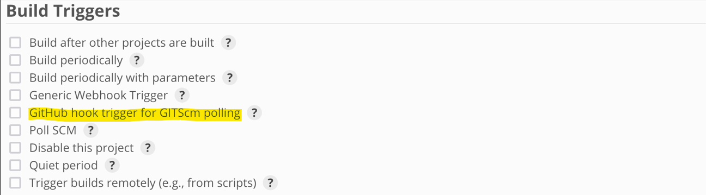

# Jenkins tutorial

Learning Jenkins from [Complete Jenkins Pipeline Tutorial](https://youtu.be/7KCS70sCoK0). Special thanks to Nanuchi for creating the course.

## Content

Jenkins allows developers to <mark>continuously</mark> build, test, & deploy the code to check that the application is stable. This allows for continuous development.

**Why Use Jenkinsfile?**: Instead of creating new jobs for Jenkins via GUI, Jenkinsfile is a pipeline as a code. A pipeline is a process of deploying source code from repo to production.

## Practical: Create Jenkinsfile to Build & Deploy App

The [demo app](../docker%20tutorial/README.md) from Docker tutorial will be used. All code files wil be located there.

## Jenkins Concepts

**Pipeline**: This is a user-defined model of a build, test and deploy process for a project.

**Node**: A machine that the Jenkins Controller executes pipeline jobs on.

**Stage**: A logical grouping of jobs that are executed in sequence, usually categorized into "build", "test", & "deploy" stages.

### Step 1: Create Jenkinsfile

Create `Jenkinsfile` at base repository folder.

### Step 2: Declarative Pipeline Syntax

**Scripted vs Declarative Syntax**

Jenkins supports 2 versions of Pipeline syntax. Scripted syntax is much more complicated than Declarative syntax but offers high flexibility.

**Declarative Syntax Advantages**

1. Modern way of developing Pipelines.
2. Easy to read.
3. Easy to code.
4. Allows restarting from specific stage.

### Step 3: Jenkinsfile Syntax

```groovy
pipeline {
    agent any

    // Environmental Variables
    environment {
        NEW_VERSION = "1.3.0"
        SERVER_CREDENTIALS = credentials("server_credentials")
    }

    // Tools
    tools {
        go "go1.15.7"
    }

    // Parameters
    parameters {
        string(name: "VERSION", defaultValue: "", description: "version to deploy on production")
        choice(name: "VERSION", choices: ["1.1.0", "1.2.0", "1.3.0"], description: "you mom")
        booleanParam(name: "executeTest", defaultValue: true, description: "")
    }

    stages {
        stage("build") {

            // Conditionals
            when {
                expression {
                    BRANCH_NAME == "dev" || BRANCH_NAME == "master"
                }
            }

            steps {
                // sh "npm install" // example
                echo "building application version ${NEW_VERSION} . . ."
            }
        }
        stage("test") {

            // Parameters
            when {
                expression {
                    params.executeTest
                }
            }

            steps {

                // Groovy Script
                script {
                    def youMom = "/path/to/you/mom"
                    if (youMom) {
                        println "youMom exists"
                        echo "testing application version ${VERSION} . . ."
                    }
                }

            }
        }
        stage("deploy") {
            steps {
                echo "deploying the application . . ."

                // Credentials with Wrappers
                withCredentials([
                    usernamePassword(credentials: "server_credentials", usernameVariable: USER, passwordVariable: PWD)
                ]) {
                    sh "script ${USER} ${PWD}"
                }

            }
        }
    }
    post {
        always {
            // always executed despite end result
        }
        success {
            // only executed if all stages pass
        }
        failure {
            // only executed if any stage fails
        }
    }
}
```

**pipeline**: [Required] Declares a pipeline.

**agent**: [Required]

    agent {
        <parameters>
    }

Specifies where the Pipeline will execute in Jenkins environment. Good to specify with `label` parameter on a Jenkins cluster with master & slave nodes.

- Parameters: [Required]
  - `any`: Executes the Pipeline on any available agent.
  - `label <label_name>`: Executes the Pipeline on any agent with the provided label.

**stages**: [Required] Combines a sequence of 1 or more `stage`s.

**stage**: [Required] Contains a `steps` action.

**steps**: [Required] Define commands to be executed for each stage.

    stages {
        stage("<stage_name>") {
            steps {
                <commands>
            }
        }
    }

**post**:

    post {
        <condition> {
            <steps here>
        }
    }

Defines additional steps run after each `stage`'s / `pipeline`'s completion. This is dependent on where `post` is placed.

- Condition:
  - `always`: Always run the steps regardless of status. _NOTE: The most popular condition._
  - `failure`: Only run the steps if status is "failed:.
  - `success`: Only run the steps if status is "success".

### Step 4: Jenkinsfile Expressions

**when**:

    when {
        expression { <boolean_expression> }
    }

Determines if stage should be executed depending on given condition. Similar to an `if` statement. Only 1 `when` statement is allowed per stage.

- `expression`: Executes when Groovy expression is true.

### Step 5: Environmental Variables

**environment**:

    environment {
        <KEY> = "<value>"
    }

Specifies a list of key value pairs to be defined as environment variables. Used with `${KEY}`.

**Using Credentials from Jenkins GUI in Jenkinsfile**

It's possible to use credentials defined in Jenkins GUI in Jenkinsfile. Enable this by enabling "Credentials Binding" & "Credentials" plugins from Jenkins GUI.

**withCredentials**:

    withCredentials([<credential_type>(credentials: "<credential_ID>", <variable_type>, <VARIABLE>)]) {
        <steps here>
    }

Allows various kinds of credentials or secrets to be used. The credentials can be used within the scope.

- Options:
  - `credential_type`: Type of credential; specified in Jenkins GUI (eg. `usernamePassword()`).
  - `credential_ID`: Credential ID aka unique name of credential; specified in Jenkins GUI.
  - `variable_type`: Variable parameter, depends on credential type.
  - `VARIABLE`: Name of variable to be used in Jenkinsfile.

### Step 6: Making Build Tools Available

**tools**

    tools {
        <tool_name>: <tool_version>
    }

Defines tools to install & put into `$PATH`.

### Step 7: Parameterized Build

**parameters**

    parameters {
        <parameter_type>(name: <name>, defaultValue: <default_value>, description: <description>)
    }

List of parameters that a user should provide in Jenkins GUI before Pipeline runs. Call with `params.<name>`.

In Jenkins GUI, "Build" is replaced with "Build with Parameters". All values must be filled.

- Options:
  - `parameter_type`:
    - `string`: Strings.
    - `text`: Text; can contain multiple lines.
    - `booleanParam`: `true` / `false`.
    - `choice`: Additional parameter required.
      - `choices`: Specifies a list of choices (eg `choices: ["your", "mom"]`).
    - `password`: Password.

### Step 8: Using External Groovy Script

**script**

    script {
        <groovy_commands>
    }

Jenkinsfile offers basic logic. To enhance this, we can use Groovy scripts to do more (eg define variables, if else statements, try catch statements). These are enclosed in `script` tags.

```groovy
// Groovy Script
script {
    def youMom = "/path/to/you/mom"
    if (youMom) {
        println "youMom exists"
        echo "testing application version ${VERSION} . . ."
    }
}
```

### Step 9: Creating a Build in Jenkins

Create a new item with any name & select "Multibranch Pipeline".

Under "Branch Sources", type your repository URL. Add your credentials.

Save.

Jenkins will automatically start building the configuration from your detected Jenkinsfile in the repository.

### Tips

1. Modify Jenkinsfile in Jenkins GUI
   - Navigate into the branch, then "Replay".
   - This is useful for debugging or for short term changes.
2. Use Timeouts at the Stage Level
   - Prevents the Pipeline stage from running indefinitely.
   - **timeout**
     ```groovy
     stage("<stage_name>") {
         timeout(time: <time_in_minutes>)
     }
     ```
   - Enforces a time limit.
3. Use Github Hook Trigger for Github Integration
   - 
   - It is preferrable as Jenkins does not have to constantly poll Github to monitor changes.

## Credits

- prod by blvnk.
- [TechWorld with Nana](https://twitter.com/Njuchi_)
