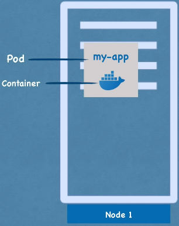
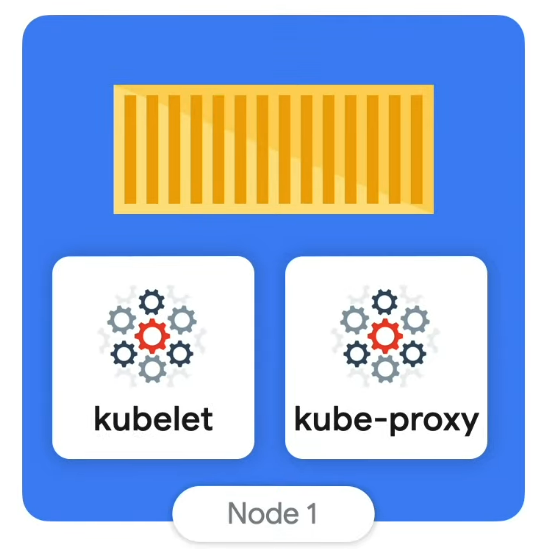
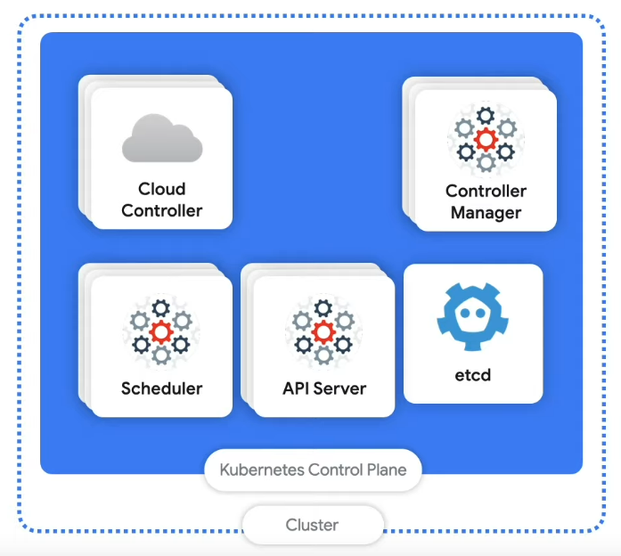
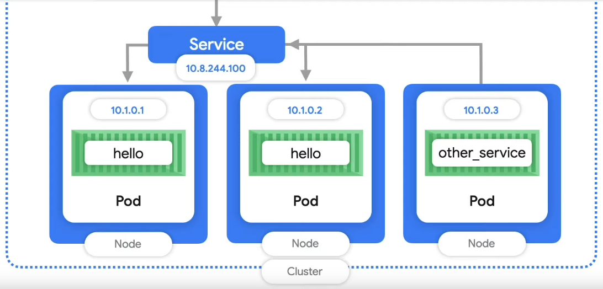
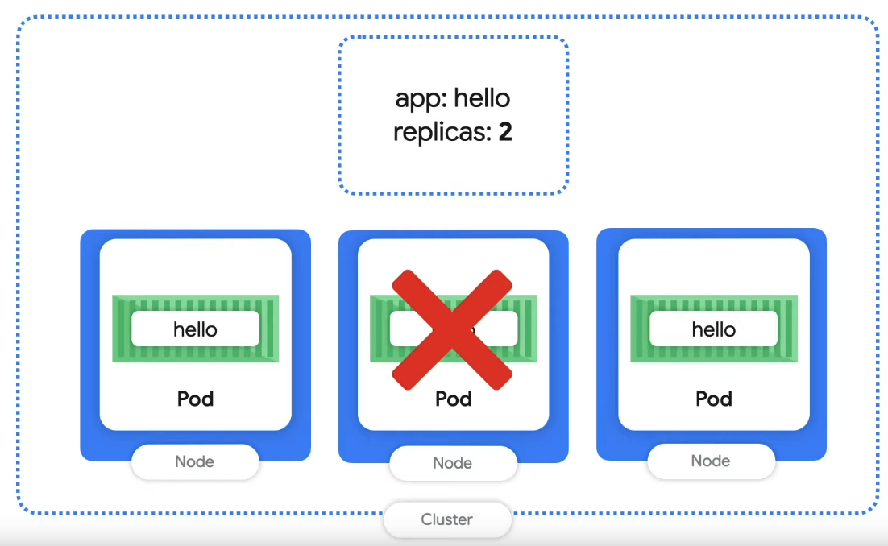
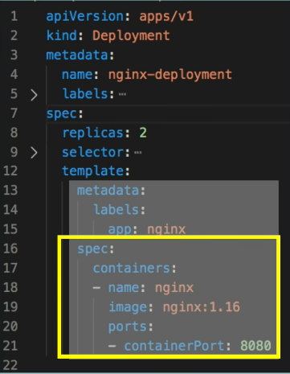
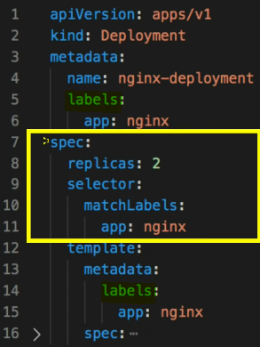
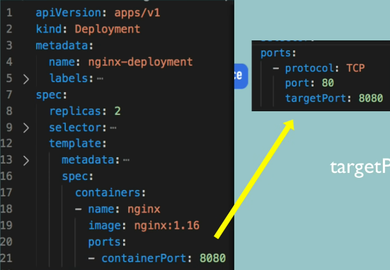
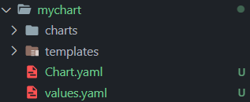
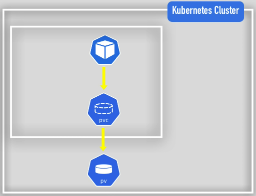

# Kubernetes Tutorial

Kubernetes: Open source container orchestration tool.

Learning Kubernetes from [Kubernetes Tutorial for Beginners](https://youtu.be/X48VuDVv0do). Special thanks to Nanuchi for creating the course.

## Table of Contents <!-- omit in toc -->

- [Intro](#intro)
- [Main K8s Components](#main-k8s-components)
- [Kubectl Commands](#kubectl-commands)
  - [Debugging Commands](#debugging-commands)
- [Installing minikube](#installing-minikube)
  - [Basic minikube Commands](#basic-minikube-commands)
- [Deploying MongoDB & MongoExpress _[Practical]_](#deploying-mongodb--mongoexpress-practical)
- [Extras](#extras)
  - [K8s Ingress](#k8s-ingress)
  - [Helm](#helm)
  - [K8s Volumes](#k8s-volumes)
  - [StatefulSet](#statefulset)
  - [Tips](#tips)

## Intro

Watch videos 1-4, 6 [Kubernetes Essentials from Google Cloud](https://www.youtube.com/playlist?list=PLIivdWyY5sqLmnGdKSdQIXq2sd_1bWSnx) playlist for a quick introduction to Kubernetes.

You should get an overview of the following:

- Problems Kubernetes Solves
- Pods & Containers

## Main K8s Components

**Pod**



A Pod is a collection of multiple containers (eg 1 or more apps that are run together). It's an abstraction over container(s).

**Node**



A Node is a virtual or physical machine that workloads are run on.

Nodes are comprised of:

1. **Container Runtime**: Runs containers.
2. **Kubelet**: Makes sure everything is running.
3. **Kube-Proxy**: Handles networking.

**Control Plane (Master Nodes)**



Kubernetes manages the cluster via the Control Plane via exposing the API.

Components in the Control Plane:

1. **API Server**: Handles data validation & configuration of API objects.
2. **etcd**: Key-value store for important cluster data.
3. **Scheduler**: Makes decisions where Pods are run (eg looks at available resources & schedules a Pod to a Node that can handle it).
4. **Controller Manager**: Handles core K8s logic (eg lifecycle management, which makes sure all resources are working correctly).
5. **Cloud Controller Manager**: Lets K8s link to cloud providers.

**Service**



Creates an endpoint that can be used to access Pods. Each Pod has its own IP address, & the Service automatically updates its list of endpoints to target the Pod. If there are multiple Nodes, the Service load balances incoming traffic.

Types of Services:

- **External Service**: Endpoints are accessible outside K8s.
- **Internal Service**: Endpoints are accessible only inside K8s.

**Deployment**



Abstraction over Pods that manages a Pod's lifecycle (eg controls amount of replicas, tells K8s to schedule another replica if the the current Node crashes). Pods are typically configured via Deployments, so Pods are not directly interacted with.

- For <mark>stateless apps</mark>.

**StatefulSet**

- Like Deployment but for <mark>stateful databases</mark>.

**ConfigMap**: Stores non-confidential data (key-value pairs). Stored in etcd.

**Secret**: Stores small amount of sensitive data (eg passwords, tokens). Stored in etcd.

**Volumes**: Storage for data persistence. K8s doesn't manage data persistence.

**Namespaces**

Isolates groups of resources within a cluster. Provides logical separation.

Kubernetes provides 4 default Namespaces:

1. **kube-system**: system processes.
2. **kube-public**: publicly accessible data (no authentication required).
3. **kube-node-lease**: determines availability of a node.
4. **default**

Namespace Characteristics:

- Resources cannot be accessed from another Namespace (eg ConfigMap / Secret).
- Services are <mark>shared</mark> across Namespaces.
- Volumes & Nodes are created outside of Namespaces.

## Kubectl Commands

**get**

List 1 or more resources.

    kubectl get <type> <name> <flags>

- Required:
  - `type`: Type of resource. See [K8s Resource Shortnames](#k8s-resource-shortnames) for resource type examples.
- Options:
  - `name`: Name of resource of relevant resource type.
  - `flags`:
    - `-o <format>`: Output format (eg `yaml`, `json`, `wide`).
    - `-l <label>`: Selector. Filter by label.
    - `-A`: Select all resources from all namespaces.

_TIP: Use `grep` for additional filters._

**api-resources**

List all available API resources & shortnames.

    kubectl api-resources

**delete**

Deletes 1 or more resources.

    kubectl delete <type> <name> <flags>

- Required:
  - `type`: Type of resource.
- Options:
  - `name`: Name of resource of relevant resource type.
  - `flags`:
    - `-f <file_name>`: Filename of resource to delete.
    - `-grace-period <seconds>`: Time to wait before deleting resources. Set to 1 for immediate deletion.
    - `-o <format>`: Output format (eg `yaml`, `json`, `wide`).
    - `-A`: Select all resources from all namespaces.

**apply**

Apply a configuration to a resource by file (eg `yaml` files). Creates resources if they don't exist, updates resources if they do. This is the recommended way of managin K8s applications.

      kubectl apply -f <file_name>

- Required:
  - `file_name`: Filename of resource to apply. Can be stacked (eg `-f <file_name> -f <file_name_1>`).

### Debugging Commands

**explain**

Get documentation of the resource & its fields.

    kubectl explain <resource>

**logs**

Logs events from containers & stores inside a pod.

    kubectl logs <pod_name> <flags>

- Options:
  - `flags`:
    - `-p`: Print logs for previous instance of the container.

**describe**

Check resource state & events. Commonly used for pods.

    kubectl describe <type> <name>

**exec -it**

Access CLI of a container.

    kubectl exec -it <pod_name> <shell>

- Options:
  - `shell`: Shell to run (eg `/bin/bash`).

**K8s Config File**

<mark>3 parts</mark> of a Config File

1. Metadata
2. Specification:
   - Where the actual configuration goes.
   - Specific to the kind (ie type of K8s component).
3. Status
   - Auto-generated by Kubernetes.
   - Checks if desired status is the same as actual status.
   - Status comes from `etcd`.



`template` describes configurations for the Pod.

**Selectors & Labels**



`label`s are given to both Deployment & Pods. `selector` connects the Deployment to the Pod.

**Ports**



`targetPort` of Service must match `containerPort` of Deployment.

**Get Entire Configuration**

    kubectl get deployment [deployment_name] -o yaml

Gets entire configuration of Deployment & output is in YAML format.

## Installing minikube

- [minikube](https://minikube.sigs.k8s.io/docs/start/)
- [kubectl](https://kubernetes.io/docs/tasks/tools/) (also in Docker)

### Basic minikube Commands

Starts a local Kubernetes cluster. Driver specifies which driver to run K8s in.

    minikube start [--driver driver_name]
    minikube status
    minikube stop
    minikube delete

## Deploying MongoDB & MongoExpress _[Practical]_

**Browser Request Flow**

Browser → External Service (Mongo Express) → Pod (Mongo Express) → Internal Service (MongoDB) → Pod (MongoDB), authenticated w/ Secrets

**Deploying MongoDB & MongoExpress**

1. Create [mongo.yaml](Demo_Project/mongo.yaml)
2. Create [mongo_secret.yaml](Demo_Project/mongo_secret.yaml)
   - _Note: Secrets must be applied before Deployment._
3. Apply Secret

   ```
   kubectl apply -f mongo_secret.yaml
   ```

   - View secrets with the following command.

   ```
   kubectl get secret
   ```

4. Apply MongoDB
   ```
   kubctl apply -f mongo.yaml
   ```
5. Add Service to [mongo.yaml](Demo_Project/mongo.yaml)
   - Deployment & Service usually belong together in 1 file.
6. Reapply MongoDB
   - Deployment is unchanged but Service is created.
7. Create [mongo_express.yaml](Demo_Project/mongo_express.yaml)
8. Create [configmap.yaml](Demo_Project/configmap.yaml)
   - ConfigMap must exist before Deployment is applied.
9. Apply ConfigMap & MongoExpress
   ```
   kubectl apply -f configmap.yaml
   kubectl apply -f mongo_express.yaml
   ```
10. Create External Service (ie Ingress) as [ingress.yaml](Demo_Project/ingress.yaml)
    - Service is the same as MongoExpress.
    - To make [mongo_express.yaml](Demo_Project/mongo_express.yaml) an external service, add `type: LoadBalancer`.
    - `nodePort` must be between 30000 - 32767.
    - External Service has both an internal port & external port.
11. Assign External Service a Public IP Address
    ```
    minikube service mongo-express-service
    ```

## Extras

### K8s Ingress

**Without Ingress**: External Request → External Service → Pod

**With Ingress**: External Request → Ingress Controller → Ingress Internal Service → Internal Service → Pod

_Note: Ingress has no NodePort._

**Ingress Controller**

- Evaluates all the rules.
- Manages redirections.
- Entrypoint to cluster.

It is a requirement to configure an entrypoint (eg proxy server like a cloud load balancer).

**Ingress Use Cases**

- Multiple paths for the same host.
- Multiple sub-domains or domains.

#### Minikube Ingress Controller

    minikube addons enable ingress

Enabling Ingress to kubernetes-dashboard via dashboard.com.

1. Create [dashboard_ingress.yaml](Ingress_Demo/dashboard_ingress.yaml)
2. Apply It.
   ```
   kubectl apply -f dashboard_ingress.yaml
   ```
   - `Default Backend` attribute used for requests that are unmapped (ie does not exist in URL mapping). This is configurable (eg create a custom page) by creating a Service with name `default-http-backend` on port 80.

#### Configuring HTTPS

Add the following to Ingress inside Spec:

```yaml
tls:
  - hosts:
      - myapp.com
    # references Secret stored elsewhere
    secretName: myapp-secret-tls
```

For data in Secret, it has to be named as the following:

```yaml
tls.crt: cert
tls.key: key
```

_Note: Secret must be in same Namespace._

### Helm

Helm is a package manager of K8s, similar to apt, yum, or brew. Helm packages YAML files & distributes them in public & private repos.

**Helm Chart**: Bundle of YAML files.

**Templating Engine**

1. Helm defines a common blueprint for YAML files.
2. Use dynamic values to replace placeholders.
   - Example of a template.
     ```yaml
     apiVersion: v1
     kind: Pod
     metadata:
       name: { { .Values.name } }
     spec:
       containers:
         - name: { { .Values.container.name } }
           image: { { .Values.container.image } }
           port: { { .Values.container.port } }
     ```
   - The values are defined in `values.yaml` file.
     ```yaml
     name: myapp
     container:
       name: my-app-container
       image: my-app-image
       port: 9001
     ```

**Helm Chart Structure**



`Chart.yaml`: Meta info about chart (eg name, dependencies, version, etc).
`values.yaml`: Values for template files. Can be overridden.
`charts/`: Chart dependencies.
`templates/`: Actual template files.

**Deploy Helm Files**

- Normal deployment.
  ```
  helm install <chartname>
  ```
- Use alternate values.
  ```
  helm install --values=<values_v2.yaml> <chartname>
  ```

### K8s Volumes

3 Components of Kubernetes Storage:

1. Persistent Volume
   - Is a cluster resource & created via YAML file.
   - It makes (physical) storage available to the cluster.
   - If a Pod requires it, PVs must exist <mark>before</mark> applying Deployment.
   - Example file: [persistent_volume.yaml](Volumes/persistent_volumes.yaml)
2. PVC (Persistent Volume Claim)
   - 
   - Application has to claim PV via PVC.
   - PVC is made inside Namespace.
   - Apps can access mounted data in `/var/www/html`
   - Example file: [pvc.yaml](Volumes/pvc.yaml)
3. Storage Class
   - Creates PVs dynamically when PVCs claim it.
   - Add into PVC file:
     ```yaml
     storageClassName: storage_class_name
     ```
   - Steps to use Storage Class:
     1. Pod claims storage via PVC.
     2. PVC requests storage from SC.
     3. SC creates PV that meets the needs of that claim.

### StatefulSet

Deployment for stateless applications, StatefulSet for stateful applications.

|                 Deployment                 |               StatefulSet               |
| :----------------------------------------: | :-------------------------------------: |
|                                            | can't be created / deleted at same time |
|        identical & interchangeable         |     replica Pods are not identical      |
| created in random order with random hashes |       can't be randomly addressed       |
|  1 service that load balances to any Pod   |                                         |

**Pod Identity**

Each Pod has a sticky identity. This is created from the <mark>same specification</mark>, but <mark>not interchangeable</mark>.

Only Master Pod can read & write, & worker Pods can <mark>only</mark> read. Worker Pods clone from previous Pod.

**StatefulSet Pod Characteristics**

1. Predictable Pod Name
2. Fixed Individual DNS Name

### Tips

1. `alias k=kubectl`: Alias for `kubectl`.
2. `alias kc='k config view --minify | grep name'`: List all configured contexts & namespaces.
3. K8s Resource Shortnames
   - |         Resource          | Shortname |
     | :-----------------------: | :-------: |
     |         ConfigMap         |    cm     |
     |         Namespace         |    ns     |
     |           Nodes           |    no     |
     |     PersistentVolume      |    pv     |
     |   PersistentVolumeClaim   |    pvc    |
     |            Pod            |    po     |
     |          Service          |    svc    |
     | CustomResourceDefinitions |    crd    |
     |        Deployments        |  deploy   |
     |        ReplicaSets        |    rs     |
     |       StatefulSets        |    sts    |
     |         CronJobs          |    cj     |
     |      NetworkPolicies      |  netpol   |

## Credits <!-- omit in toc -->

- prod by blvnk.
- [TechWorld with Nana](https://twitter.com/Njuchi_)
