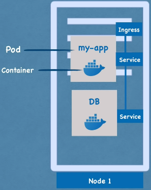
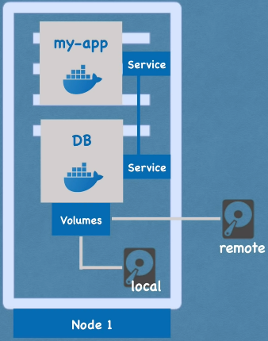
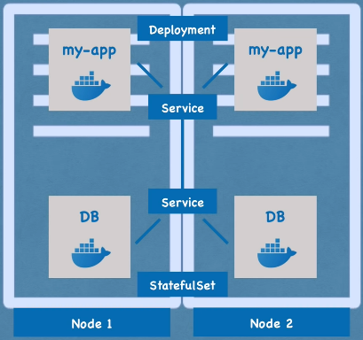
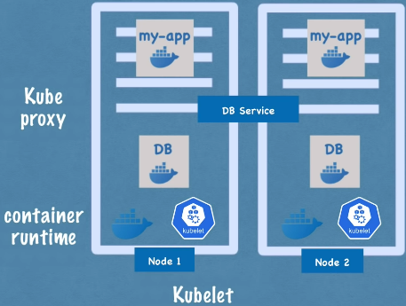
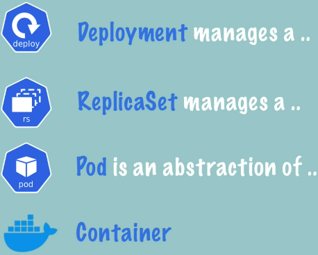

# Kubernetes Tutorial

Learning Kubernetes from [Kubernetes Tutorial for Beginners](https://youtu.be/X48VuDVv0do). Special thanks to Nanuchi for creating the course.

## Content

Kubernetes: Open source container orchestration tool.

### Main K8s Components

**Pod**


- Smallest unit of K8s.
- Abstraction over container.
- <mark>1 application per Pod</mark>.
- Each Pod has its IP address.
- New IP address upon re-creation.

**Service**



- Permanent IP address attached to Pod.
- **External Service**
  - Accessible outside K8s.
- **Internal Service**
  - Accessible only by K8s.
- **Ingress**
  - Routes traffic into cluster.
  - External Requests → Ingress → External Service

**ConfigMap**: Setting configuration data (eg env var).

**Secret**: ConfigMap but base64 encoded.



**Volumes**: Storage for data persistence. K8s doesn't manage data persistence.



**Deployment**

- Blueprint for Pods.
- Abstraction over Pods.
- You interact with Deployments, not Pods.
- For <mark>stateless apps</mark>.

**StatefulSet**

- Like Deployment but for <mark>stateful databases</mark>.

### K8s Architecture

**Node**



- Cluster service that does the actual work.
- Each Node has multiple Pods.
- <mark>3 processes</mark> must be on every Node.
  1.  **Container Runtime** (eg Docker)
  2.  **Kubelet**: Interacts between Container Runtime & Node.
  3.  **Kube Proxy**: Network proxy that forwards requests <mark>intelligently</mark>.

**Master Nodes**

- Manages processes.
- <mark>4 processes</mark> that run on every Master Node:
  1. **API Server**: Acts as cluster gateway into the cluster.
  2. **Scheduler**: After API Server validates request, Scheduler forwards request to appropriate Node.
  3. **Controller Manager**: Detects cluster state changes (eg Node dies) & recovers cluster state if anything is wrong.
  4. **etcd**: Key-value store for critical info (eg config data, state data, & metadata).

### Installing minikube & kubectl

- [minikube](https://minikube.sigs.k8s.io/docs/start/)
- [kubectl](https://kubernetes.io/docs/tasks/tools/) (also in Docker)

#### Basic minikube Commands

```
minikube start [--driver driver_name]
```

Starts a local Kubernetes cluster. Driver specifies which driver to run K8s in.

```
minikube status
minikube stop
minikube delete
```

#### Basic kubectl Commands

    kubectl get nodes
    kubectl get pod [-o wide]
    kubectl get services
    kubectl get deployment
    kubectl get replicaset

_Note: Wide output prints more info (eg IP address)._



Kubernetes manages from ReplicaSet to Containers. We manage Deployments.

**Debugging Pods**

```
kubectl logs [pod_name]
kubectl describe pod [pod_name]
```

Prints Pod logs. Use `describe` for detailed info (eg status).

```
kubectl exec -it [pod_name] /bin/bash
```

Enter the CLI of a container.

**Delete Deployment**

```
kubectl delete deployment [deployment]
```

**Config Files**

```
kubectl apply -f [file]
kubectl delete -f [file]
```

Creates Deployment. If it exists, it updates Deployment. Config Files can be used for Volumes & Services.

### K8s Config File

<mark>3 parts</mark> of a Config File

1. Metadata
2. Specification:
   - Where the actual configuration goes.
   - Specific to the kind (ie type of K8s component).
3. Status
   - Auto-generated by Kubernetes.
   - Checks if desired status is the same as actual status.
   - Status comes from `etcd`.


`template` describes configurations for the Pod.

**Selectors & Labels**


`label`s are given to both Deployment & Pods. `selector` connects the Deployment to the Pod.

**Ports**


`targetPort` of Service must match `containerPort` of Deployment.

**Get Entire Configuration**

    kubectl get deployment [deployment_name] -o yaml

Gets entire configuration of Deployment & output is in YAML format.

### Deploying MongoDB & MongoExpress _[Practical]_

**Browser Request Flow**

Browser → External Service (Mongo Express) → Pod (Mongo Express) → Internal Service (MongoDB) → Pod (MongoDB), authenticated w/ Secrets

**Deploying MongoDB & MongoExpress**

1. Create [mongo.yaml](Demo_Project/mongo.yaml)
2. Create [mongo_secret.yaml](Demo_Project/mongo_secret.yaml)
   - _Note: Secrets must be applied before Deployment._
3. Apply Secret

   ```
   kubectl apply -f mongo_secret.yaml
   ```

   - View secrets with the following command.

   ```
   kubectl get secret
   ```

4. Apply MongoDB
   ```
   kubctl apply -f mongo.yaml
   ```
5. Add Service to [mongo.yaml](Demo_Project/mongo.yaml)
   - Deployment & Service usually belong together in 1 file.
6. Reapply MongoDB
   - Deployment is unchanged but Service is created.
7. Create [mongo_express.yaml](Demo_Project/mongo_express.yaml)
8. Create [configmap.yaml](Demo_Project/configmap.yaml)
   - ConfigMap must exist before Deployment is applied.
9. Apply ConfigMap & MongoExpress
   ```
   kubectl apply -f configmap.yaml
   kubectl apply -f mongo_express.yaml
   ```
10. Create External Service (ie Ingress) as [ingress.yaml](Demo_Project/ingress.yaml)
    - Service is the same as MongoExpress.
    - To make [mongo_express.yaml](Demo_Project/mongo_express.yaml) an external service, add `type: LoadBalancer`.
    - `nodePort` must be between 30000 - 32767.
    - External Service has both an internal port & external port.
11. Assign External Service a Public IP Address
    ```
    minikube service mongo-express-service
    ```

### K8s Namespace

Namespaces allow for isolating groups of resources within a single cluster.

Kubernetes provides 4 default Namespaces:

1. **kube-system**: system processes.
2. **kube-public**: publicly accessible data (no authentication required).
3. **kube-node-lease**: determines availability of a node.
4. **default**

Why use Namespaces?

1. To group resources.
2. Prevent conflicts withing multiple teams developing the same application.
3. Resource sharing between staging & development.
   - Reuse some components.
4. Resource sharing between blue / green deployment.
5. Resource access & limits within Namespace.

Namespace Characteristics:

- You can't access most resources from another Namespace (eg ConfigMap / Secret).
- Services are <mark>shared</mark> across Namespaces.
- Volumes & Nodes <mark>cannot be created inside of Namespaces</mark>.

### K8s Ingress

**Without Ingress**: External Request → External Service → Pod

**With Ingress**: External Request → Ingress Controller → Ingress Internal Service → Internal Service → Pod

_Note: Ingress has no NodePort._

**Ingress Controller**

- Evaluates all the rules.
- Manages redirections.
- Entrypoint to cluster.

It is a requirement to configure an entrypoint (eg proxy server like a cloud load balancer).

**Ingress Use Cases**

- Multiple paths for the same host.
- Multiple sub-domains or domains.

#### Minikube Ingress Controller

    minikube addons enable ingress

Enabling Ingress to kubernetes-dashboard via dashboard.com.

1. Create [dashboard_ingress.yaml](Ingress_Demo/dashboard_ingress.yaml)
2. Apply It.
   ```
   kubectl apply -f dashboard_ingress.yaml
   ```
   - `Default Backend` attribute used for requests that are unmapped (ie does not exist in URL mapping). This is configurable (eg create a custom page) by creating a Service with name `default-http-backend` on port 80.

#### Configuring HTTPS

Add the following to Ingress inside Spec:

```yaml
tls:
  - hosts:
      - myapp.com
    # references Secret stored elsewhere
    secretName: myapp-secret-tls
```

For data in Secret, it has to be named as the following:

```yaml
tls.crt: cert
tls.key: key
```

_Note: Secret must be in same Namespace._

### Helm

Helm is a package manager of K8s, similar to apt, yum, or brew. Helm packages YAML files & distributes them in public & private repos.

**Helm Chart**: Bundle of YAML files.

**Templating Engine**

1. Helm defines a common blueprint for YAML files.
2. Use dynamic values to replace placeholders.
   - Example of a template.
     ```yaml
     apiVersion: v1
     kind: Pod
     metadata:
       name: { { .Values.name } }
     spec:
       containers:
         - name: { { .Values.container.name } }
           image: { { .Values.container.image } }
           port: { { .Values.container.port } }
     ```
   - The values are defined in `values.yaml` file.
     ```yaml
     name: myapp
     container:
       name: my-app-container
       image: my-app-image
       port: 9001
     ```

**Helm Chart Structure**


`Chart.yaml`: Meta info about chart (eg name, dependencies, version, etc).
`values.yaml`: Values for template files. Can be overridden.
`charts/`: Chart dependencies.
`templates/`: Actual template files.

**Deploy Helm Files**

- Normal deployment.
   ```
   helm install <chartname>
   ```
- Use alternate values.
   ```
   helm install --values=<values_v2.yaml> <chartname>
   ```

### K8s Volumes

3 Components of Kubernetes Storage:

1. Persistent Volume
   - Is a cluster resource & created via YAML file.
   - It makes (physical) storage available to the cluster.
   - If a Pod requires it, PVs must exist <mark>before</mark> applying Deployment.
   - Example file: [persistent_volume.yaml](Volumes/persistent_volumes.yaml)
2. PVC (Persistent Volume Claim)
   - 
   - Application has to claim PV via PVC.
   - PVC is made inside Namespace.
   - Apps can access mounted data in `/var/www/html`
   - Example file: [pvc.yaml](Volumes/pvc.yaml)
3. Storage Class
   - Creates PVs dynamically when PVCs claim it.
   - Add into PVC file:
     ```yaml
     storageClassName: storage_class_name
     ```
   - Steps to use Storage Class:
     1. Pod claims storage via PVC.
     2. PVC requests storage from SC.
     3. SC creates PV that meets the needs of that claim.

### StatefulSet

Deployment for stateless applications, StatefulSet for stateful applications.

|                 Deployment                 |               StatefulSet               |
| :----------------------------------------: | :-------------------------------------: |
|                                            | can't be created / deleted at same time |
|        identical & interchangeable         |     replica Pods are not identical      |
| created in random order with random hashes |       can't be randomly addressed       |
|  1 service that load balances to any Pod   |                                         |

**Pod Identity**

Each Pod has a sticky identity. This is created from the <mark>same specification</mark>, but <mark>not interchangeable</mark>.

Only Master Pod can read & write, & worker Pods can <mark>only</mark> read. Worker Pods clone from previous Pod.

**StatefulSet Pod Characteristics**

1. Predictable Pod Name
2. Fixed Individual DNS Name

### Tips


## Credits

- prod by blvnk.
- [TechWorld with Nana](https://twitter.com/Njuchi_)
