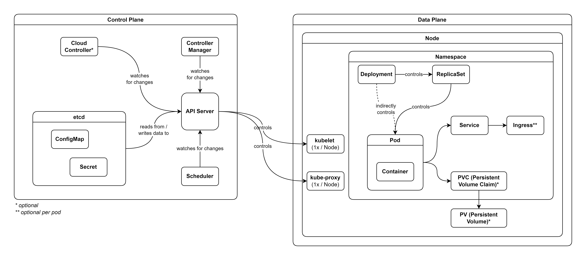

# Kubernetes Tutorial

Kubernetes: Open source container orchestration tool.

Learning Kubernetes from [Kubernetes Tutorial for Beginners](https://youtu.be/X48VuDVv0do). Special thanks to Nanuchi for creating the course.

## Table of Contents <!-- omit in toc -->

- [About](#about)
- [Basic K8s Architecture](#basic-k8s-architecture)
  - [Control Plane](#control-plane)
  - [Data Plane](#data-plane)
- [Kubectl Commands](#kubectl-commands)
  - [Debugging Commands](#debugging-commands)
- [minikube](#minikube)
- [[Practical] Deploying MongoDB & MongoExpress](#practical-deploying-mongodb--mongoexpress)
- [Extras](#extras)
  - [K8s Ingress](#k8s-ingress)
  - [Helm](#helm)
  - [K8s Volumes](#k8s-volumes)
  - [StatefulSet](#statefulset)
- [Tips](#tips)

## About

Cheat sheets & concise references for Kubernetes, an open-source container orchestration system.

## Basic K8s Architecture



### Control Plane

**API Server**: Exposes K8s API & is the front end for K8s control plane.

**etcd**: Highly-available key value store for all cluster data.

**Scheduler**: Schedules a Pod to a Node for the Pod to run on. The process relies on multiple factors (eg resource requirements, policy constraints, etc).

**Controller Manager**: Attempts to ensure that current state matches desired state.

**ConfigMap**: Stores non-sensitive configuration for other resources to use.

**Secret**: Stores sensitive data for other resources to use.

### Data Plane

**kubelet**: Ensures that containers are running in a Pod.

**kube-proxy**: Network proxy on each Node that exposes Pods as a network service.

**Pod**: Smallest deployable unit in K8s. Group of 1 or more containers that run together.

**Node**: Physical / virtual machines that run K8s workloads.

**ReplicaSet**: Maintains a stable set of replica Pods.

**Deployment**: Abstraction over Pods & ReplicaSets. Changes Pod & ReplicaSet to their desired state.

**Service**: Abstraction for network service for Pods. Assigns each Pod their own IP addresses & a DNS name for a set of Pods. Load-balances network traffic. 

**Ingress**: Manages  & exposes external network traffic to Services.

**Namespace**: Isolates a group of resources within a cluster. The resources must be a namespaced object (eg Deployments, Services, etc).

**PVC (Persistent Volume Claim)**: Request for storage (PV) by a Pod.

**PV (Persistent Volume)**: Local (K8s) or remote storage, of which the latter is preferentially used.

## Kubectl Commands

**get**:List 1 or more resources.

    kubectl get <type> <name> <flags>

- Required:
  - `type`: Type of resource. See [K8s Resource Shortnames](#k8s-resource-shortnames) for resource type examples.
- Options:
  - `name`: Name of resource of relevant resource type.
  - `flags`:
    - `-o <format>`: Output format (eg `yaml`, `json`, `wide`).
    - `-l <label>`: Selector. Filter by label.
    - `-A`: Select all resources from all namespaces.

_TIP: Use `grep` for additional filters._

**api-resources**: List all available API resources & shortnames.

    kubectl api-resources

**delete**: Deletes 1 or more resources.

    kubectl delete <type> <name> <flags>

- Required:
  - `type`: Type of resource.
- Options:
  - `name`: Name of resource of relevant resource type.
  - `flags`:
    - `-f <file_name>`: Filename of resource to delete.
    - `-grace-period <seconds>`: Time to wait before deleting resources. Set to 1 for immediate deletion.
    - `-o <format>`: Output format (eg `yaml`, `json`, `wide`).
    - `-A`: Select all resources from all namespaces.

**apply**: Apply a configuration to a resource by file (eg `yaml` files). Creates resources if they don't exist, updates resources if they do. This is the recommended way of managin K8s applications.

      kubectl apply -f <file_name>

- Required:
  - `file_name`: Filename of resource to apply. Can be stacked (eg `-f <file_name> -f <file_name_1>`).

### Debugging Commands

**explain**: Get documentation of the resource & its fields.

    kubectl explain <resource>

**logs**: Logs events from containers & stores inside a pod.

    kubectl logs <pod_name> <flags>

- Options:
  - `flags`:
    - `-p`: Print logs for previous instance of the container.

**describe**: Check resource state & events. Commonly used for pods.

    kubectl describe <type> <name>

**exec -it**: Access CLI of a container.

    kubectl exec -it <pod_name> <shell>

- Options:
  - `shell`: Shell to run (eg `/bin/bash`).

**K8s Config File**

<mark>3 parts</mark> of a Config File

1. Metadata
2. Specification:
   - Where the actual configuration goes.
   - Specific to the kind (ie type of K8s component).
3. Status
   - Auto-generated by Kubernetes.
   - Checks if desired status is the same as actual status.
   - Status comes from `etcd`.


`template` describes configurations for the Pod.

**Selectors & Labels**


`label`s are given to both Deployment & Pods. `selector` connects the Deployment to the Pod.

**Ports**


`targetPort` of Service must match `containerPort` of Deployment.

**Get Entire Configuration**

    kubectl get deployment [deployment_name] -o yaml

Gets entire configuration of Deployment & output is in YAML format.

## minikube

- [minikube](https://minikube.sigs.k8s.io/docs/start/)
- [kubectl](https://kubernetes.io/docs/tasks/tools/) (also in Docker)

**minikube Commands**

Starts a local Kubernetes cluster. Driver specifies which driver to run K8s in.

    minikube start [--driver driver_name]
    minikube status
    minikube stop
    minikube delete

## [Practical] Deploying MongoDB & MongoExpress

**Browser Request Flow**

Browser → External Service (Mongo Express) → Pod (Mongo Express) → Internal Service (MongoDB) → Pod (MongoDB), authenticated w/ Secrets

**Deploying MongoDB & MongoExpress**

1. Create [mongo.yaml](Demo_Project/mongo.yaml)
2. Create [mongo_secret.yaml](Demo_Project/mongo_secret.yaml)
   - _Note: Secrets must be applied before Deployment._
3. Apply Secret

   ```
   kubectl apply -f mongo_secret.yaml
   ```

   - View secrets with the following command.

   ```
   kubectl get secret
   ```

4. Apply MongoDB
   ```
   kubctl apply -f mongo.yaml
   ```
5. Add Service to [mongo.yaml](Demo_Project/mongo.yaml)
   - Deployment & Service usually belong together in 1 file.
6. Reapply MongoDB
   - Deployment is unchanged but Service is created.
7. Create [mongo_express.yaml](Demo_Project/mongo_express.yaml)
8. Create [configmap.yaml](Demo_Project/configmap.yaml)
   - ConfigMap must exist before Deployment is applied.
9. Apply ConfigMap & MongoExpress
   ```
   kubectl apply -f configmap.yaml
   kubectl apply -f mongo_express.yaml
   ```
10. Create External Service (ie Ingress) as [ingress.yaml](Demo_Project/ingress.yaml)
    - Service is the same as MongoExpress.
    - To make [mongo_express.yaml](Demo_Project/mongo_express.yaml) an external service, add `type: LoadBalancer`.
    - `nodePort` must be between 30000 - 32767.
    - External Service has both an internal port & external port.
11. Assign External Service a Public IP Address
    ```
    minikube service mongo-express-service
    ```

## Extras

### K8s Ingress

**Without Ingress**: External Request → External Service → Pod

**With Ingress**: External Request → Ingress Controller → Ingress Internal Service → Internal Service → Pod

_Note: Ingress has no NodePort._

**Ingress Controller**

- Evaluates all the rules.
- Manages redirections.
- Entrypoint to cluster.

It is a requirement to configure an entrypoint (eg proxy server like a cloud load balancer).

**Ingress Use Cases**

- Multiple paths for the same host.
- Multiple sub-domains or domains.

#### Minikube Ingress Controller

    minikube addons enable ingress

Enabling Ingress to kubernetes-dashboard via dashboard.com.

1. Create [dashboard_ingress.yaml](Ingress_Demo/dashboard_ingress.yaml)
2. Apply It.
   ```
   kubectl apply -f dashboard_ingress.yaml
   ```
   - `Default Backend` attribute used for requests that are unmapped (ie does not exist in URL mapping). This is configurable (eg create a custom page) by creating a Service with name `default-http-backend` on port 80.

#### Configuring HTTPS

Add the following to Ingress inside Spec:

```yaml
tls:
  - hosts:
      - myapp.com
    # references Secret stored elsewhere
    secretName: myapp-secret-tls
```

For data in Secret, it has to be named as the following:

```yaml
tls.crt: cert
tls.key: key
```

_Note: Secret must be in same Namespace._

### Helm

Helm is a package manager of K8s, similar to apt, yum, or brew. Helm packages YAML files & distributes them in public & private repos.

**Helm Chart**: Bundle of YAML files.

**Templating Engine**

1. Helm defines a common blueprint for YAML files.
2. Use dynamic values to replace placeholders.
   - Example of a template.
     ```yaml
     apiVersion: v1
     kind: Pod
     metadata:
       name: { { .Values.name } }
     spec:
       containers:
         - name: { { .Values.container.name } }
           image: { { .Values.container.image } }
           port: { { .Values.container.port } }
     ```
   - The values are defined in `values.yaml` file.
     ```yaml
     name: myapp
     container:
       name: my-app-container
       image: my-app-image
       port: 9001
     ```

**Helm Chart Structure**


`Chart.yaml`: Meta info about chart (eg name, dependencies, version, etc).
`values.yaml`: Values for template files. Can be overridden.
`charts/`: Chart dependencies.
`templates/`: Actual template files.

**Deploy Helm Files**

- Normal deployment.
  ```
  helm install <chartname>
  ```
- Use alternate values.
  ```
  helm install --values=<values_v2.yaml> <chartname>
  ```

### K8s Volumes

3 Components of Kubernetes Storage:

1. Persistent Volume
   - Is a cluster resource & created via YAML file.
   - It makes (physical) storage available to the cluster.
   - If a Pod requires it, PVs must exist <mark>before</mark> applying Deployment.
   - Example file: [persistent_volume.yaml](Volumes/persistent_volumes.yaml)
2. PVC (Persistent Volume Claim)
   - 
   - Application has to claim PV via PVC.
   - PVC is made inside Namespace.
   - Apps can access mounted data in `/var/www/html`
   - Example file: [pvc.yaml](Volumes/pvc.yaml)
3. Storage Class
   - Creates PVs dynamically when PVCs claim it.
   - Add into PVC file:
     ```yaml
     storageClassName: storage_class_name
     ```
   - Steps to use Storage Class:
     1. Pod claims storage via PVC.
     2. PVC requests storage from SC.
     3. SC creates PV that meets the needs of that claim.

### StatefulSet

Deployment for stateless applications, StatefulSet for stateful applications.

|                 Deployment                 |               StatefulSet               |
| :----------------------------------------: | :-------------------------------------: |
|                                            | can't be created / deleted at same time |
|        identical & interchangeable         |     replica Pods are not identical      |
| created in random order with random hashes |       can't be randomly addressed       |
|  1 service that load balances to any Pod   |                                         |

**Pod Identity**

Each Pod has a sticky identity. This is created from the <mark>same specification</mark>, but <mark>not interchangeable</mark>.

Only Master Pod can read & write, & worker Pods can <mark>only</mark> read. Worker Pods clone from previous Pod.

**StatefulSet Pod Characteristics**

1. Predictable Pod Name
2. Fixed Individual DNS Name

## Tips

1. `alias k=kubectl`: Alias for `kubectl`.
2. `alias kc='k config view --minify | grep name'`: List all configured contexts & namespaces.
3. K8s Resource Shortnames
   - |         Resource          | Shortname |
     | :-----------------------: | :-------: |
     |         ConfigMap         |    cm     |
     |         Namespace         |    ns     |
     |           Nodes           |    no     |
     |     PersistentVolume      |    pv     |
     |   PersistentVolumeClaim   |    pvc    |
     |            Pod            |    po     |
     |          Service          |    svc    |
     | CustomResourceDefinitions |    crd    |
     |        Deployments        |  deploy   |
     |        ReplicaSets        |    rs     |
     |       StatefulSets        |    sts    |
     |         CronJobs          |    cj     |
     |      NetworkPolicies      |  netpol   |

## Credits <!-- omit in toc -->

- prod by blvnk.
- [TechWorld with Nana](https://twitter.com/Njuchi_)
