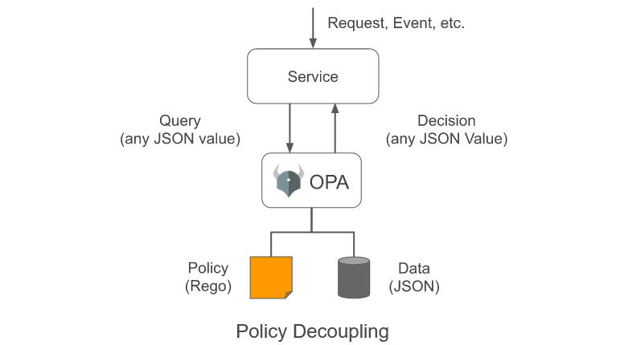
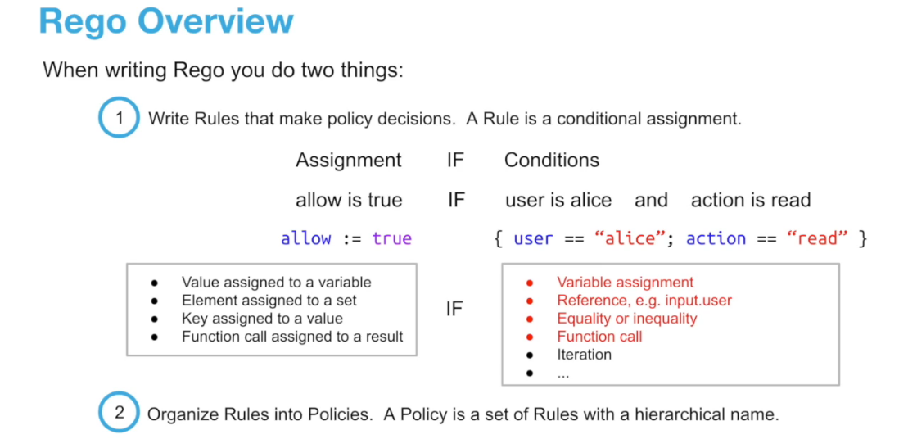

# OPA & Gatekeeper Tutorial

OPA (Open Policy Agent) tutorial summary. Check out the [full tutorial](https://academy.styra.com/courses/opa-rego) @[Styra Academy](https://academy.styra.com). Big ups to them.

## Intro

)

OPA is a policy engine that allows you to define policies and enforce them. Specifically, the service enforces the decision, but OPA makes the decision. OPA runs on the same server as the application for maximum performance.

For a microservice application, it does not need to be modified to integrate with OPA. Instead, a network proxy is used.

For Kubernetes resource configurations, OPA can be integrated in:

1. **Kubernetes API Server.** Done via a webhook during admission control so all resources must pass OPA before being deployed.
2. **CICD Pipeline.** If Kubernetes resources needs to be checked into source-control.
3. **Developer Laptops.** To evaluate policies as unit tests.

**OPA Features**

- **Declarative Policy Language (Rego)**
  - 50+ built-in functions for JWTs, datetime, CIDR math etc.
  - Context-aware policies (eg Kubernetes).
- **Library (Go), Sidecar / Host-Level Daemon**
  - OPA runs on the same server. If there are 100 Kubernetes clusters, there will be 100 OPA instances.
- **Management APIs**
  - Bundle service allows OPA to receive policies.
  - Status service for receiving status from OPA.

## Rego Expressions



### Single Values

**Values & Variables**: Rego supports String, Number, Boolean, Array, Object, null, & Set.

**Variable Assignment**: Done with `s := "Hello World"`

_NOTE: Variables are immutable. Treat them as constants. This is because Rego is a declarative language._

**Input & Data Variables**

`input` is a global variable for storing JSON object passed to OPA.

`data` is a global variable for storing external data given to OPA (eg other rules).

**(Tip) Dot Expressions**: Dot `.` (eg `obj.key`) is shorthand for `obj["key"]`.

**Undefined**

When a path is missing, result is `undefined`, not an error (ie OPA does not throw an error, but does not display the result).

- `not` turns `undefined` to `true`.
- `not` turns `false` to `true`.
- `not` turns everything else into `undefined`.

### Comparing & Constructing Values

**Equality Expressions**: `==`

**Built-In Expressions**

Below is a non-exhaustive list of built-in functions. Refer to [Policy Reference](https://www.openpolicyagent.org/docs/latest/policy-reference/) for more.

| Category                | Functions                                                      |
| ----------------------- | -------------------------------------------------------------- |
| Basic                   | `==`, `!=`, `<`, `>`, `<=`, `>=`, `+`, `-`, `*`, `/`, `%`      |
| Strings                 | `concat`, `lower`, `trim`, `replace`, regex, glob, `split`     |
| Arrays / Sets / Objects | `concat`, `slice`, `intersection`, `union`, `remove`, `filter` |
| Aggregates              | `count`, `sum`, `min`, `sort`                                  |
| Parsing                 | base64, urlquery, json, yaml                                   |
| Tokens                  | verify, decode, encode                                         |
| Time                    | `time.date`, time, `time.add_date`                             |
| Network CIDRs           | `net.cidr_contains`, `net.cidr_intersects`, `net.cidr_expand`  |

## Basic Rego Rules

### Boolean Rules & Evaluation

**Boolean Rules**

Boolean rules are IF statements that assign a variable to `true` / `false`.

```rego
# variable `allow` is assigned to `true` if the following conditions are satisfied, else false.
default allow = false
allow = true {
    . . .
}
```

`default` is an optional keyword to set default value.

_Tip: Skip `true` for a shortcut, eg `allow = true { . . . }` is equivalent to `allow = { . . . }`._

### Rule Chaining & Non-Boolean Rules

**Logical AND & OR Rule Evaluation**

AND is achieved by chaining condition in the same rule, eg:

```rego
allow {
    condition_1
    condition_2
}
```

OR is achieved by chaining multiple rules, eg:

```rego
allow {
    condition_1
}
allow {
    condition_2
}
```

**Non-Boolean Rules**

Specify rule assignment with `=` (eg `code = 200 { not deny }`).

Values can be computed, eg:

```rego
port_number = result {
    values := split(input.request.host, ":")
    result := to_number(values[1])
}
```

Multiple values can be returned via an object, eg:

```rego
content = result {
    result := {
        "story": "Hello World",
        "author": "hi blvnk"
    }
}
```

**Policy Decisions**

A Policy Decision is the value of the variable. This is typically used for enforcing policies.

## [Practical] Rego Rules

Follow the [practical tutorial](https://academy.styra.com/courses/take/opa-rego/texts/23090465-section-1-getting-started) for verbose info.

**Getting Started**

1. Initialise your policy.
   - Create policy file `policy.rego` with content as below.
   ```rego
   package rules
   default allow = false
   ```
2. Add some user data.
   - Add user data to `policy.rego`.
   ```rego
   users := {
       "alice":   {"manager": "charlie", "title": "salesperson"},
       "bob":     {"manager": "charlie", "title": "salesperson"},
       "charlie": {"manager": "dave",    "title": "manager"},
       "dave":    {"manager": null,      "title": "ceo"}
   }
   ```
3. Evaluate your policy.
   - Run `opa eval -d policy.rego "data.rules"` to evaluate your policy.

**Start CarInfoStore Policy**

1. Write a rule that allows everyone to `GET /cars`.
   ```rego
   allow {
       input.method == "GET"
       input.path == ["cars"]
   }
   ```
2. Specify input for the rule.
   - Create input file `input.json` with content as:
   ```json
   {
     "method": "GET",
     "path": ["cars"],
     "user": "alice"
   }
   ```
   - Run `opa eval -d policy.rego -i input.json "data.rules"` to evaluate your policy.
3. Test rule with different input.
   - Change `input.json` to:
   ```json
   {
     "method": "POST",
     "path": ["cars"],
     "user": "alice"
   }
   ```
   - Re-evaluate OPA. Notice that the value for `allow` is `false`.

**Write Tests**

1. Write tests.
   - Create test file `policy_test.rego` with content as:
   ```rego
   package rules_test
   import data.rules.allow as allow
   test_car_read_positive {
       in = {
           "method": "GET",
           "path": ["cars"],
           "user": "alice",
       }
       allow == true with input as in
   }
   test_car_read_negative {
       in = {
           "method": "GET",
           "path": ["nonexistent"],
           "user": "alice",
       }
       allow == false with input as in
   }
   ```
   - Run tests with `opa test -v .`. Both tests should pass.

**Finish the Policy**

1. Create helpers.
   - Add helper definitions to `policy.rego` with:
   ```rego
   user_is_employee {
       users[input.user]
   }
   user_is_manager {
       users[input.user].title != "salesperson"
   }
   ```
   - Write a rule to allow only managers to create new cars in `policy.rego`:
   ```rego
   allow {
       # only managers can create a new car
       input.method == "POST"
       user_is_manager
       input.path == ["cars"]
   }
   ```
   - Add tests to `policy_test.rego` with:
   ```rego
   test_car_create_negative {
       in = {
           "method": "POST",
           "path": ["cars"],
           "user": "alice",
       }
       allow == false with input as in
   }
   test_car_create_positive {
       in = {
           "method": "POST",
           "path": ["cars"],
           "user": "charlie",
       }
       allow == true with input as in
   }
   ```
   - Run tests with `opa test -v .`. All 4 tests should pass.
2. Finish the policy.
   - Write the logic that allows only employees to `GET /cars/{carid}`. You can assume that input.path comes in as an array (eg `["cars", "id789-932"]`).
   - Styra solution:
   ```rego
   allow {
       # only employees can GET /cars/{carid}
       user_is_employee
       input.path == ["cars", carid]
       input.method == "GET"
   }
   ```
   - _NOTE: OPA will fail as `carid` is not defined._
   - To solve this, define `carid` & add the following rule to `policy.rego`:
   ```rego
   allow {
       # only employees can GET /cars/{carid}
       user_is_employee
       carid := input.path[1]
       input.path == ["cars", carid]
       input.method == "GET"
   }
   ```

**(Extras) Modify Input**

1. Modify `input.json` with the following values & re-evaluate OPA each time.
   ```json
   {
     "input": {
       "method": "POST",
       "path": ["cars"],
       "user": "alice"
     }
   }
   ```
   ```json
   {
     "input": {
       "method": "POST",
       "path": ["cars"],
       "user": "charlie"
     }
   }
   ```
